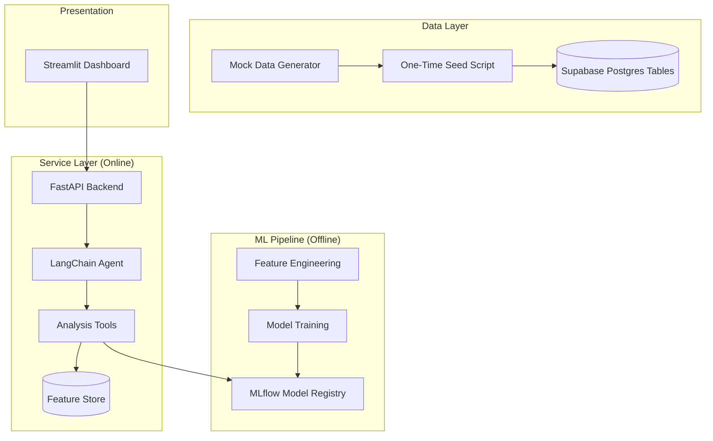

# FinChat Analytics — AI-Powered Customer Retention Platform

[](https://www.python.org/)
[](https://fastapi.tiangolo.com/)
[](https://opensource.org/licenses/MIT)
[](https://mlflow.org/)

**FinChat Analytics** is a high-performance B2B analytics platform designed for banks, fintech startups, and SMEs. It leverages advanced causal discovery and predictive modeling to provide actionable insights into customer behavior, retention, and lifetime value through a natural language interface.

---

## 🚀 Key Capabilities

-   **🧠 Causal Discovery**: Identify direct drivers of churn using `DirectLiNGAM` structural causal modeling.
-   **⏳ Survival Analysis**: Predict precisely *when* a customer will churn using Cox Proportional Hazards models.
-   **💎 CLV Estimation**: Calculate Customer Lifetime Value using BG/NBD and Gamma-Gamma probabilistic models.
-   **📈 Uplift Modeling**: Quantify the incremental impact of marketing promotions (T-Learner approach).
-   **🤖 AI Agent**: A LangChain-powered assistant that translates natural language queries into complex data insights.

---

## 🏗️ System Architecture



---

## 🛠️ Tech Stack

| Category | Technologies |
| :--- | :--- |
| **Frameworks** | FastAPI, Streamlit, LangChain |
| **Machine Learning** | Scikit-learn, Causal-learn, Lifetimes, Lifelines |
| **Data Engineering** | Pandas, SQLAlchemy, Supabase Postgres |
| **MLOps** | MLflow, Docker, GitHub Actions |
| **Cloud** | AWS (RDS, ECS, S3, ECR) |

---

## ⚙️ Quick Start

### 1. Environment Setup
Clone the repository and install dependencies:
```bash
git clone https://github.com/chikien07012006/FinChat-Analytics.git
cd FinChat-Analytics
pip install -r requirements.txt
```

### 2. Configuration
Create a `.env` file in the root directory:
```env
DATABASE_URL=postgresql://postgres:<password>@db.klvsuurcyhhtfhsfjvcs.supabase.co:5432/postgres?sslmode=require
SUPABASE_URL=https://klvsuurcyhhtfhsfjvcs.supabase.co
OPENAI_API_KEY=your_key
```

### 3. Data Initialization
Initialize Supabase and seed synthetic banking data once:
```bash
# Create tables in Supabase
# Run SQL script: data/table_design.sql

# Generate mock CSVs and seed Supabase
python data/generate_bank_data.py
python data/seed_supabase.py
```

After this seed step, normal analytics and model runs read from Supabase directly.

### 4. Run the Pipeline
Train models and register them with MLflow:
```bash
python -m pipeline.train_all_models
```

Open the local MLflow UI:
```bash
mlflow ui --backend-store-uri sqlite:///mlflow.db --port 5000
```

---

## 📅 Roadmap

- [x] Phase 1: Synthetic Data Infrastructure
- [x] Phase 2: Core Predictive ML Pipeline
- [/] Phase 3: AI Agent & Integration (In Progress)
- [ ] Phase 4: Streamlit Dashboard Deployment
- [ ] Phase 5: Production Deployment on AWS
