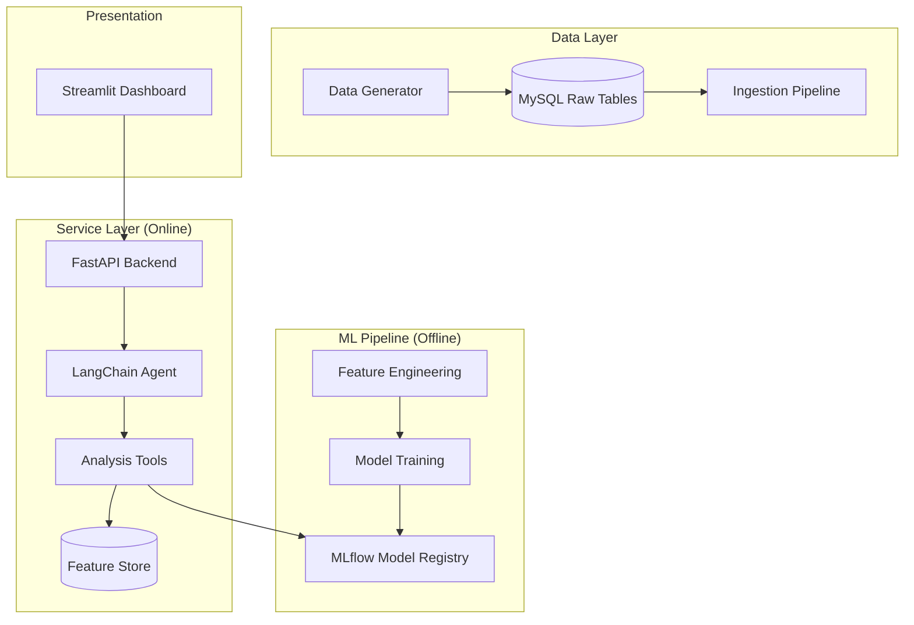

# FinChat Analytics — AI-Powered Customer Retention Platform

[](https://www.python.org/)
[](https://fastapi.tiangolo.com/)
[](https://opensource.org/licenses/MIT)
[](https://mlflow.org/)

**FinChat Analytics** is a high-performance B2B analytics platform designed for banks, fintech startups, and SMEs. It leverages advanced causal discovery and predictive modeling to provide actionable insights into customer behavior, retention, and lifetime value through a natural language interface.

---

## 🚀 Key Capabilities

-   **🧠 Causal Discovery**: Identify direct drivers of churn using `DirectLiNGAM` structural causal modeling.
-   **⏳ Survival Analysis**: Predict precisely *when* a customer will churn using Cox Proportional Hazards models.
-   **💎 CLV Estimation**: Calculate Customer Lifetime Value using BG/NBD and Gamma-Gamma probabilistic models.
-   **📈 Uplift Modeling**: Quantify the incremental impact of marketing promotions (T-Learner approach).
-   **🤖 AI Agent**: A LangChain-powered assistant that translates natural language queries into complex data insights.

---

## 🏗️ System Architecture



---

## 🛠️ Tech Stack

| Category | Technologies |
| :--- | :--- |
| **Frameworks** | FastAPI, Streamlit, LangChain |
| **Machine Learning** | Scikit-learn, Causal-learn, Lifetimes, Lifelines |
| **Data Engineering** | Pandas, SQLAlchemy, MySQL |
| **MLOps** | MLflow, Docker, GitHub Actions |
| **Cloud** | AWS (RDS, ECS, S3, ECR) |

---

## ⚙️ Quick Start

### 1. Environment Setup
Clone the repository and install dependencies:
```bash
git clone https://github.com/chikien07012006/FinChat-Analytics.git
cd FinChat-Analytics
pip install -r requirements.txt
```

### 2. Configuration
Create a `.env` file in the root directory:
```env
DB_HOST=localhost
DB_PORT=3306
DB_NAME=finchat
DB_USER=root
DB_PASSWORD=your_password
OPENAI_API_KEY=your_key
```

### 3. Data Initialization
Initialize the database and generate synthetic banking data:
```bash
# Create tables
# Run SQL script: data/table_design.sql

# Generate & Ingest data
python data/generate_bank_data.py
python data/ingestion_pipeline.py
```

### 4. Run the Pipeline
Train models and register them with MLflow:
```bash
python pipeline/train_all_models.py
```

---

## 📅 Roadmap

- [x] Phase 1: Synthetic Data Infrastructure
- [x] Phase 2: Core Predictive ML Pipeline
- [/] Phase 3: AI Agent & Integration (In Progress)
- [ ] Phase 4: Streamlit Dashboard Deployment
- [ ] Phase 5: Production Deployment on AWS

